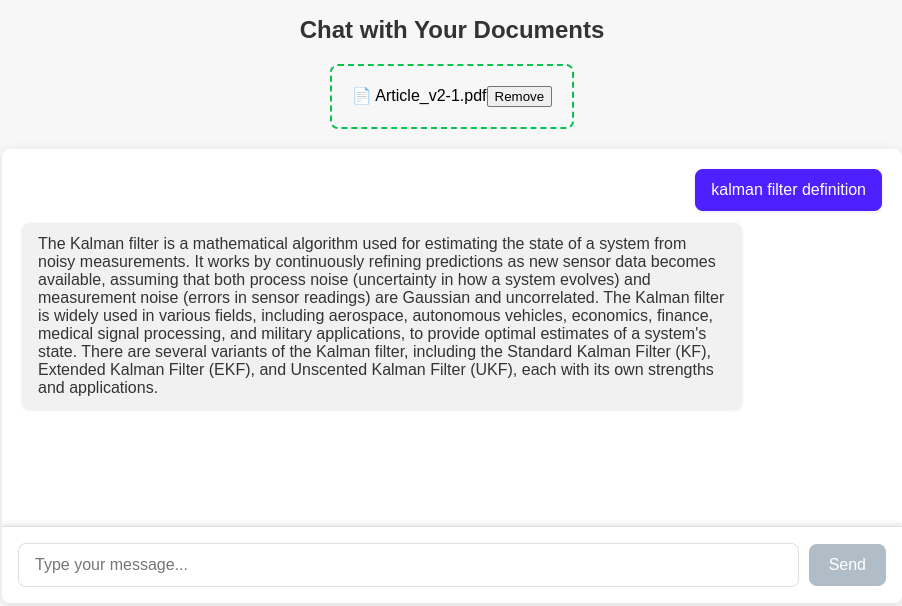

# Chat-with-Your-Documents

An authenticated, multi-user AI document Q&A platform. Upload PDFs, ask questions
in natural language, and get answers grounded in your own documents with page
citations — with each user's documents and conversations fully isolated from
every other user's.

[](https://opensource.org/licenses/MIT)
[](https://reactjs.org/)
[](https://fastapi.tiangolo.com/)



## What this is

This started as a single-user RAG demo: one page, one global vector store, no
accounts. It has been upgraded into a multi-tenant application with registration
and login, per-user document libraries, and persistent multi-conversation chat
history — without replacing the retrieval pipeline that already worked.

The RAG chain is unchanged in mechanism: `PyPDFLoader` → `CharacterTextSplitter(1000, 200)`
→ `HuggingFaceEmbeddings(all-mpnet-base-v2)` → `FAISS` → `similarity_search` →
Gemini. What changed is the architecture around it. `CHANGES.md` documents every
modified file and the reasoning behind each change.

## How user isolation works

This is the design decision worth understanding first, because it is the one the
rest of the security model rests on.

Each user gets a **separate FAISS index** at `faiss_store/{userId}/`, rather than
one shared index filtered by a metadata field at query time. The user id always
comes from the verified JWT, never from a request body or URL parameter.

The reason is that metadata filtering makes isolation *conditional* — every
retrieval path has to remember to apply the filter, and one missed filter leaks
another user's document content into an answer. Separate indexes make it
*structural*: another user's vectors are never loaded into the search at all, so
there is no code path that can return them.

The same principle applies in MongoDB. Ownership is enforced inside the query
(`{"_id": id, "userId": user_id}`) rather than by fetching a record and comparing
afterwards. A document belonging to someone else is simply not found, and returns
the same 404 as an id that never existed — so the API cannot be used to probe
which ids are real.

## Security model

Passwords are hashed with bcrypt and never stored, logged, or returned in plain
text. The register and login endpoints return identical errors for an unknown
email and a wrong password, and the unknown-email path performs an equivalent
bcrypt computation so response timing does not reveal which addresses have
accounts.

The Gemini API key stays on the backend; the frontend never sees it. Error
responses carry a short human-readable message only — stack traces, driver
internals, and file paths are logged server-side and never sent to the client.

Uploads are validated by extension, by size while streaming (so an oversized file
cannot exhaust memory), and by PDF magic bytes, so a renamed executable is
rejected. Stored filenames are UUIDs under a per-user directory, which makes path
traversal structurally impossible; the original name is sanitised for display only.

In production the server **refuses to start** if `JWT_SECRET` is unset. A known
default signing key would let anyone mint a valid token for any user id, which
would defeat every ownership check at once.

## Prerequisites

- Node.js and npm
- Python 3.10+
- MongoDB running locally (or a connection string to a hosted instance)
- A Gemini API key from Google AI Studio

## Setup

**1. Clone and enter the project**

```bash
git clone https://github.com/devcom33/Chat-with-Your-Documents.git
cd Chat-with-Your-Documents
```

**2. Create `.env` in the project root**

```env
GEMINI_API_KEY=your_gemini_api_key_here
MONGODB_URI=mongodb://localhost:27017
MONGODB_DB_NAME=chatdoc
JWT_SECRET=generate_a_long_random_string_here
APP_ENV=development
```

Generate a real secret with `python -c "import secrets; print(secrets.token_urlsafe(48))"`.
Never commit `.env`.

Only `GEMINI_API_KEY` is strictly required to start in development — the rest have
working local defaults. In any non-development `APP_ENV`, `JWT_SECRET` becomes
mandatory and the server refuses to boot without it. Other useful overrides:
`RETRIEVAL_K` (default 5), `MAX_UPLOAD_MB` (default 20), `PASSWORD_MIN_LENGTH`
(default 8), `GEMINI_MODEL`, and `CORS_ORIGINS`.

**3. Run the backend**

```bash
python -m venv venv
venv\Scripts\activate        # macOS/Linux: source venv/bin/activate
pip install -r requirements.txt
python backend_chatdoc.py
```

The API runs at `http://localhost:8000`, with interactive docs at `/docs`.

**4. Run the frontend**

```bash
cd front-chatdoc
npm install
npm run dev
```

Open the Vite URL, normally `http://localhost:5173`.

## Verifying it works

`scripts/verify_e2e.py` exercises the full flow against a running server and then
tries to break the isolation boundary from a second account. It uses only the
Python standard library, creates two throwaway users, and cleans up after itself.

```bash
python scripts/verify_e2e.py

# if you are offline or out of Gemini quota, skip the answer-generation checks:
python scripts/verify_e2e.py --skip-rag
```

It walks the flow end to end — register, login, upload, ask, check citations,
start a second chat, continue the first, log out, log back in, confirm chat
history and documents survived — and then verifies that user B cannot read,
write to, or delete any of user A's conversations or documents, that A's data is
absent from B's lists, and that asking B the exact question A's document answers
does not leak A's content into B's answer. It also checks that error responses
contain no tracebacks, internal paths, or key material. Exit code is 0 only if
every check passes.

## Project structure

```
app/
  core/        config, security (bcrypt + JWT), error handling, dependencies
  db/          MongoDB connection and index setup
  models/      Pydantic request/response schemas — the input-validation layer
  rag/         PDF -> chunks -> embeddings -> FAISS (the original pipeline)
  services/    Gemini integration and conversational RAG
  routers/     auth, users, documents, conversations
backend_chatdoc.py   entrypoint (unchanged command: python backend_chatdoc.py)
scripts/             end-to-end and isolation verification
front-chatdoc/src/
  api/         axios client with token interceptor
  context/     auth and conversation state
  components/  sidebar, upload, chat surface, citations, shared UI
  layouts/     app shell and auth shell
  pages/       dashboard, documents, chat, profile, login, register
```

## API

All routes except register and login require `Authorization: Bearer <token>`.

| Method | Path | Purpose |
| --- | --- | --- |
| POST | `/api/auth/register` | Create an account |
| POST | `/api/auth/login` | Exchange credentials for a token |
| POST | `/api/auth/logout` | Explicit sign-out |
| GET | `/api/auth/me` | Restore the current session |
| GET/PUT | `/api/users/profile` | Read or rename the profile |
| POST | `/api/documents/upload` | Upload and index a PDF |
| GET | `/api/documents` | List your documents |
| DELETE | `/api/documents/{id}` | Delete a document and its vectors |
| POST | `/api/conversations` | Start a chat |
| GET | `/api/conversations` | List your chats |
| GET | `/api/conversations/{id}` | Chat with its full message history |
| GET | `/api/conversations/{id}/messages` | Messages only |
| POST | `/api/conversations/{id}/messages` | Ask a question, get a cited answer |
| DELETE | `/api/conversations/{id}` | Delete a chat |

## Technology

React 19, Vite, styled-components, react-router-dom, react-dropzone, axios, and
react-markdown on the frontend. FastAPI, Motor (async MongoDB), bcrypt, PyJWT,
LangChain, FAISS, Hugging Face sentence-transformers, and the Google Gemini API
on the backend.

## Note on migrating from the single-user version

Vectors in the old `faiss_vector_store/` directory have no owner and are no longer
searched. Re-upload those PDFs to make them queryable again. The old directory is
left in place rather than deleted, so nothing is destroyed and the change is
reversible.
